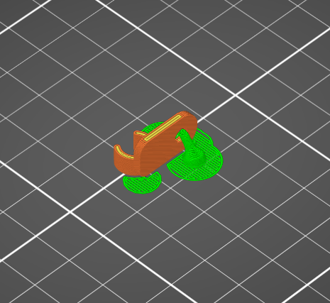

# XLR Screwclip
Quick project because paying for screwclips in this economy makes no sense. Instead use a $1000 printer to do the job for five cents.

<picture>
  
</picture>

Print on the side with the loop facing towards the build plate. This allows the layers to run along the loop for flexability and durability.

For screws, I fitted this for 5mm head and 3mm body. Wood screws tend to work well because desks are made of..... wood, I guess.

## How I printed
- Prusa Mk4S
- .15mm Layer Height
- .4mm Nozzle
- Organic Supports
